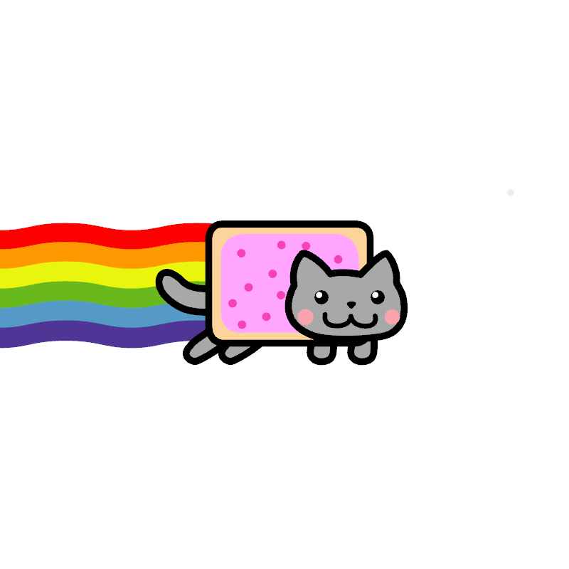

# lottie-rs

A [Lottie](https://github.com/airbnb/lottie-web) file toolkit written in Rust. Lottie is a JSON format exported with [Bodymovin](https://github.com/airbnb/lottie-web) plugin from [Adobe After Effects](http://www.adobe.com/products/aftereffects.html) describing animations. This crate aims to parse, analyze and render this animation format with multiple renderers.


# Samples

The following samples are gathered from lottiefiles.com community and lottiefiles.github.io. Credits
goes to original owners/creators of the files.

| **Name**       | **Preview**                                                  | **Name**         | **Preview**                                            |
| -------------- | ------------------------------------------------------------ | ---------------- | ------------------------------------------------------ |
| Confetti       |        | Nyan Cat         |  |
| Techno Penguin |  | Delete Animation |    |
| A (5x scaled)  |               | B  (5x scaled)   |         |
| Bounce Strokes |  |                  |                                                        |

# Try it out

The default player implementation uses [Bevy](https://github.com/bevyengine/bevy) to render the animation.
Currently supports bevy `0.13.0`.

```bash
cargo r --release -- --input ../../fixtures/ui/drink.json
```

There are some lottie files for demonstration purpose under `fixtures/ui`

## Bevy support table

| bevy | lottie-rs    |
| ---- | ------------ |
| 0.13 | main / 0.0.1 |

# Headless runner

Exporting animation headlessly is also supported, aiming to render animations on a server. Currently
you can export animation to `webp` file using the `--headless` option.

```bash
cargo r --release -- --input fixtures/ui/drink.json --headless
```

A `webp` file with the same name as input JSON will be generated.

# Feature Incompletion Notice

Due to limitation of webGPU, some features are not supported and listed below.

- Blend mode: this involves complex texture exchanging and is really hard


# Font Loading

This library uses [font-toolkit](https://github.com/alibaba/font-toolkit) to manage/load/use fonts, which
is also MIT-licensed.

If a font is missing or a system default font is used (e.g. `monospace`), currently `lottie-rs` will
use [Fira Mono](https://github.com/mozilla/Fira) as the default fallback if running on architecture
that allows local font loading. For WASM targets, this fallback logic is not present, a matching
failure will cause the text being skipped.
